# Dự án Demo Tấn công & Phòng chống lỗ hổng Mass Assignment

Dự án này là một bài tập lớn môn An toàn và Bảo mật Web, tập trung vào việc mô phỏng, phân tích và khắc phục lỗ hổng Mass Assignment trong ứng dụng NodeJS.

🌐 **Demo Website:** [https://loving-empathy-production.up.railway.app/?typeNews=vip](https://loving-empathy-production.up.railway.app/?typeNews=vip)

## 👥 Thành viên nhóm & Phân công

|          Họ và tên          | Mã Sinh viên | Vai trò & Nhiệm vụ                                                                                                      |
| :-------------------------: | :----------: | ----------------------------------------------------------------------------------------------------------------------- |
|      **Đào Duy Quyền**      | 22810310231  | - Xây dựng Backend (NodeJS/Express)<br>- Trực quan hóa kịch bản tấn công<br>- Phát triển giải pháp khắc phục (Code fix) |
| **Nguyễn Hoàng Thanh Tùng** | 22810310248  | - Tìm hiểu về Whitelists<br>- Lên kế hoạch kịch bản tấn công<br>- Xây dựng Frontend                                     |
|     **Trần Gia Thành**      | 22810310238  | - Đề xuất giải pháp khắc phục<br>- Xây dựng Frontend                                                                    |

---

## �️‍♂️ Về lỗ hổng Mass Assignment

### 1. Khái niệm (Concept)

Mass Assignment (gán giá trị hàng loạt) là một tính năng trong nhiều framework hiện đại (như NodeJS, Rails, ASP.NET) cho phép tự động gán dữ liệu từ request (ví dụ: `req.body`) vào model của đối tượng trong cơ sở dữ liệu. Điều này giúp giảm thiểu code viết tay nhưng cũng tiềm ẩn rủi ro bảo mật lớn nếu không kiểm soát dữ liệu đầu vào.

### 2. Cơ chế tấn công (Attack Mechanism)

Kẻ tấn công lợi dụng việc ứng dụng không lọc các trường dữ liệu đầu vào để chèn thêm các trường nhạy cảm mà server không mong muốn nhận.
Ví dụ: Khi cập nhật thông tin cá nhân, người dùng chỉ được phép sửa `name` hoặc `email`. Tuy nhiên, kẻ tấn công có thể gửi thêm trường `isAdmin: true` hoặc `role: "admin"` trong payload. Nếu backend gán trực tiếp toàn bộ `req.body` vào database, user đó sẽ chiếm được quyền admin.

### 3. Ví dụ minh họa (Code Example)

Đoạn code lỗ hổng điển hình trong NodeJS/MongoDB:

```javascript
// LỖ HỔNG: Gán trực tiếp req.body vào hàm tạo/update
app.post("/register", async (req, res) => {
  // Kẻ tấn công gửi: { "username": "hack", "password": "123", "role": "admin" }
  const newUser = await User.create(req.body);
  // -> User mới được tạo với quyền admin!
});
```

### 4. Kịch bản trong dự án (Project Scenario)

Trong dự án này, chúng em xây dựng một kịch bản thực tế:

- **Người dùng thường** đăng ký tài khoản hoặc cập nhật profile.
- Thực hiện **tấn công Mass Assignment** bằng cách chèn thêm các trường không được phép (ví dụ: nâng quyền hạn, thay đổi số dư...).
- Sau đó, áp dụng các biện pháp phòng chống như **Whitelisting** (chỉ nhận các trường cho phép) để vá lỗ hổng.

---

## �📂 Cấu trúc Dự án

Dự án được chia làm 2 phần chính: **Client** (Frontend) và **Server** (Backend).

### 1. Server (Backend)

Mã nguồn backend nằm trong thư mục `server/`, được xây dựng bằng **NodeJS** với các thành phần chính:

- **`src/models`**: Định nghĩa cấu trúc dữ liệu (Schema), nơi có thể phát sinh lỗ hổng nếu không kiểm soát dữ liệu đầu vào.
- **`src/controllers`**: Xử lý logic nghiệp vụ. Các hàm xử lý request cập nhật profile/đăng ký thường là nơi bị khai thác Mass Assignment.
- **`src/routes`**: Định nghĩa các API endpoint.
- **`src/middlewares`**: Các middleware xử lý, bao gồm xác thực và phân quyền (GrantAccess).
- **`src/validations`**: Chứa logic kiểm tra dữ liệu đầu vào (Validation).
- **`src/core`**, **`src/utils`**, **`src/services`**: Các tiện ích và xử lý lỗi cốt lõi.

### 2. Client (Frontend)

Mã nguồn frontend nằm trong thư mục `client/`, được xây dựng bằng **ReactJS/Vite**, cung cấp giao diện để người dùng tương tác và thực hiện demo tấn công.

- **`src/pages`**: Các trang giao diện chính (Login, Register, Dashboard, Profile...).
- **`src/components`**: Các component tái sử dụng.
- **`src/api`** (hoặc tương đương): Nơi gọi API xuống backend.

## 🚀 Cách chạy dự án

### Backend

1. Di chuyển vào thư mục server: `cd server`
2. Cài đặt thư viện: `npm install`
3. Chạy server: `npm start` (hoặc `npm run dev`)

### Frontend

1. Di chuyển vào thư mục client: `cd client`
2. Cài đặt thư viện: `npm install`
3. Chạy ứng dụng: `npm run dev`

## Hướng dẫn Demo

1: Thực hiện đăng ký tài khoản - Frontend gửi dữ liệu đơn giản:
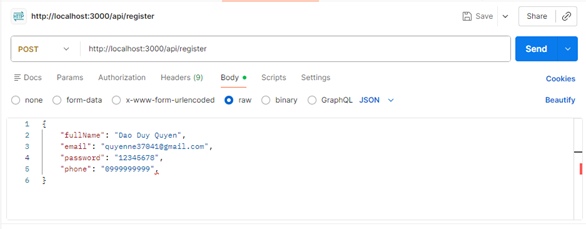

2: Hacker tấn công Mass Assignment gửi thêm các trường nhạy cảm:
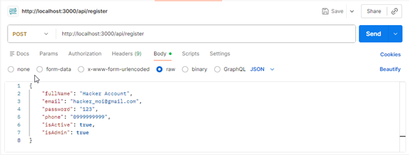

3: Minh họa lỗ hổng Mass Assignment trong API - Viết code register nguy hiểm như
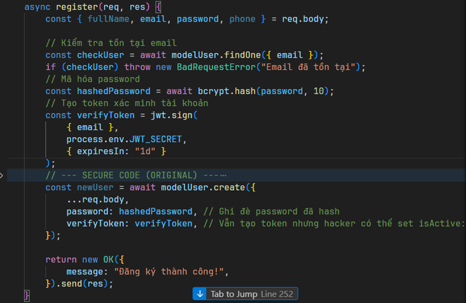

4: Cấu trúc User với nhiều trường nhạy cảm
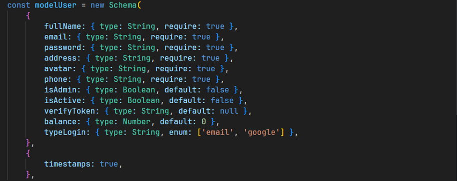

5: Code UpdateUser nguy hiểm dễ bị tấn công Mass Assignment
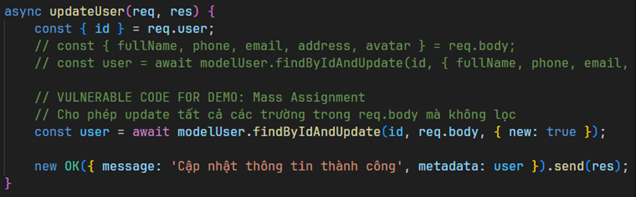

6: Hacker tấn công Mass Assignment để kich hoạt quyền Admin
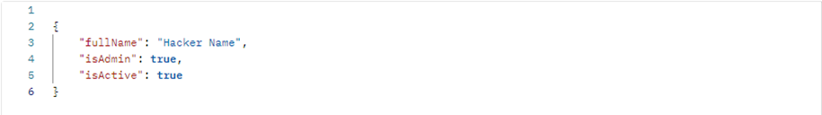

7: Hacker tấn công Mass Assignment để chỉnh số dư tài khoản
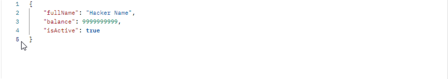

## Giải pháp xử lý

1: Xử dụng Whitelist Field với hàm UpdateUSer
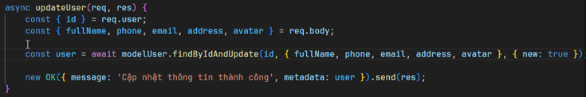

2: Xử dụng Whitelist Field với hàm Register
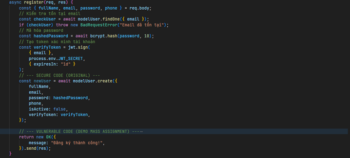

3: Sử dụng thư viện Joi để validate kiểm tra dữ liệu và loại bỏ các field không mong muốn/nhạy cảm
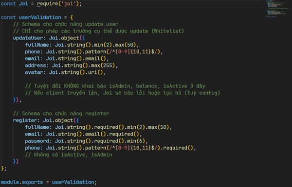

4: Phân quyền Admin với User
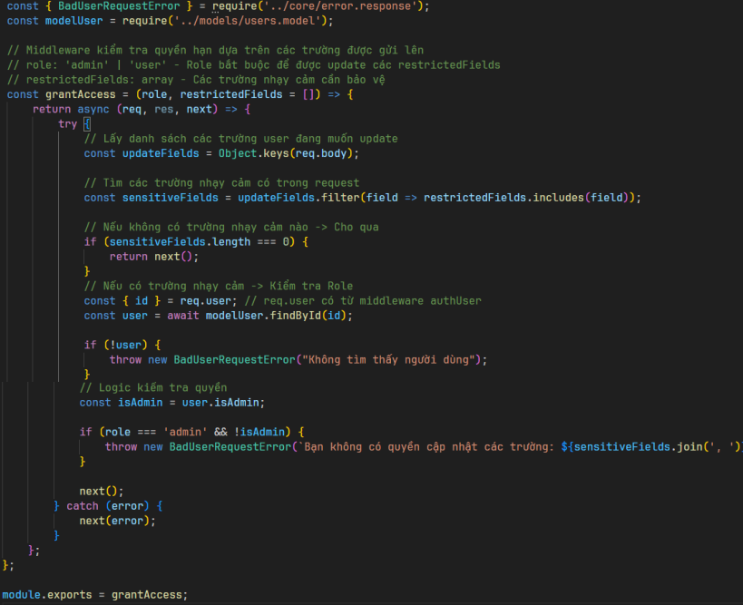

---

_Dự án phục vụ mục đích học tập và nghiên cứu về an toàn thông tin._
